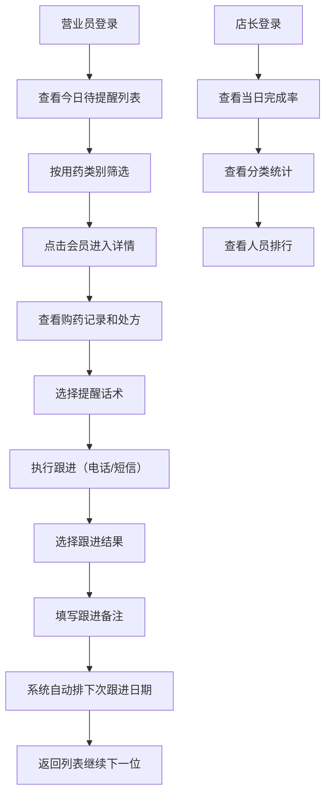

## 1. 产品概述

单体药店慢病续购提醒工作台，解决慢病处方药会员即将用完药但无人跟进导致流失的问题。面向药店店长和营业员，通过智能化的用药周期提醒、标准化话术和跟进记录，提升会员复购率和用药依从性。

## 2. 核心功能

### 2.1 用户角色

| 角色 | 登录方式 | 核心权限 |
|------|----------|----------|
| 营业员 | 工号登录 | 查看今日待提醒名单、执行会员跟进、记录跟进结果、查看会员详情 |
| 店长 | 工号登录 | 营业员全部权限 + 查看当日跟进完成率、查看全员跟进统计、分配跟进任务 |

### 2.2 功能模块

1. **今日待提醒页面**：用药类别筛选、会员列表展示、快速跟进入口、跟进状态标记
2. **会员详情页面**：基本信息、历史购药记录、处方管理、联系方式、提醒话术选择
3. **跟进记录功能**：结果选择（已接通/未接通/暂不需要/已到店购买）、自动计算下次跟进日期、跟进历史
4. **店长统计面板**：当日完成率、分类统计、人员业绩排行

### 2.3 页面详情

| 页面名称 | 模块名称 | 功能描述 |
|----------|----------|----------|
| 今日待提醒 | 顶部统计栏 | 显示今日待提醒总数、已完成数、完成率 |
| 今日待提醒 | 类别筛选标签 | 按高血压、糖尿病、降脂等用药类别切换 |
| 今日待提醒 | 会员列表 | 展示会员姓名、上次购药日期、购买盒数、预计剩余天数、处方状态、最近联系结果 |
| 今日待提醒 | 快速操作 | 一键拨打电话、发送短信、标记跟进结果 |
| 会员详情 | 基本信息卡片 | 会员头像、姓名、年龄、手机号、会员等级 |
| 会员详情 | 用药信息 | 当前用药方案、所属类别、剩余天数预警 |
| 会员详情 | 历史购药记录 | 时间线展示历次购药的药品、数量、金额、日期 |
| 会员详情 | 处方管理 | 处方照片预览、有效期、医生备注 |
| 会员详情 | 联系方式 | 手机号、备用联系人、地址 |
| 会员详情 | 提醒话术 | 电话话术、短信话术、到店话术模板，可一键复制 |
| 会员详情 | 跟进操作 | 选择跟进结果、填写备注、提交后自动排下次日期 |
| 店长统计 | 完成率仪表盘 | 当日/本周/本月跟进完成率环形图 |
| 店长统计 | 分类统计 | 按用药类别统计跟进数量和转化率 |
| 店长统计 | 人员排行 | 各营业员跟进数量和完成率排行 |

## 3. 核心流程

营业员每日登录系统后，查看今日待提醒会员列表，按用药类别筛选优先级。点击会员进入详情页，查看历史购药记录和处方信息，选择对应话术进行电话或短信提醒。完成跟进后选择结果（已接通/未接通/暂不需要/已到店购买），系统自动根据用药周期计算下次跟进日期并排入提醒队列。店长可随时查看当日跟进完成率和各营业员业绩。

## 4. 用户界面设计

### 4.1 设计风格

- **主色调**：医疗蓝（#2563EB）作为主色，传递专业、可信赖的感觉
- **辅助色**：健康绿（#10B981）表示正常/已完成，警示橙（#F59E0B）表示即将到期，危险红（#EF4444）表示已过期
- **按钮风格**：圆角 8px，主按钮实色填充，次要按钮描边
- **字体**：主字体使用 Noto Sans SC，清晰易读；数字使用等宽字体展示数据
- **布局风格**：卡片式布局，左侧导航 + 右侧内容区，信息密度适中
- **图标风格**：使用 lucide-react 线性图标，统一 24px 尺寸

### 4.2 页面设计概览

| 页面名称 | 模块名称 | UI 元素 |
|----------|----------|----------|
| 今日待提醒 | 顶部统计卡 | 渐变色卡片，大数字 + 趋势箭头 |
| 今日待提醒 | 类别标签 | 胶囊形标签，选中态有下划线动画 |
| 今日待提醒 | 会员卡片 | 横向布局，头像 + 基本信息 + 状态标签 + 操作按钮 |
| 会员详情 | 信息区 | 左右两栏布局，左侧会员信息，右侧用药状态 |
| 会员详情 | 购药记录 | 时间线样式，带药品图标和金额 |
| 会员详情 | 话术卡片 | 三栏 Tab 切换（电话/短信/到店），带复制按钮 |
| 会员详情 | 结果选择 | 大按钮组，每个结果对应不同颜色 |
| 店长统计 | 仪表盘 | 环形进度图，中间显示完成率 |
| 店长统计 | 排行榜 | 带奖牌图标（金/银/铜）的排行列表 |

### 4.3 响应式

- 桌面端优先设计，最小支持 1280px 宽度
- 平板端（768px-1280px）调整为单列布局，导航收窄
- 移动端采用底部导航 + 卡片堆叠布局，优化触摸操作

### 4.4 动效与交互

- 页面切换使用淡入淡出过渡（200ms）
- 卡片悬停有轻微上浮和阴影加深效果
- 状态标签切换有颜色过渡动画
- 列表滚动使用平滑滚动
- 数字变化有计数动画效果
