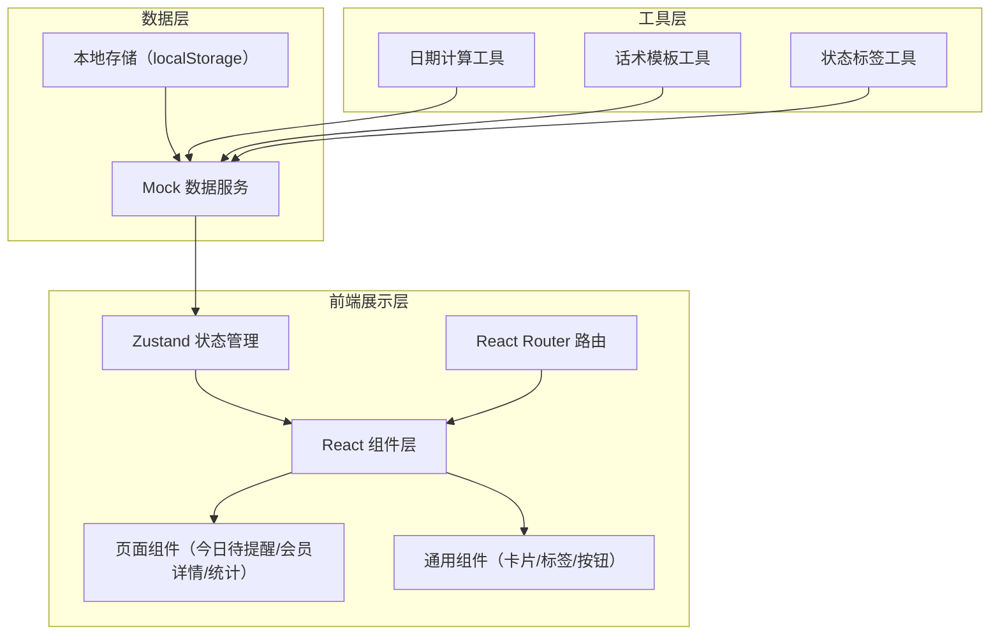
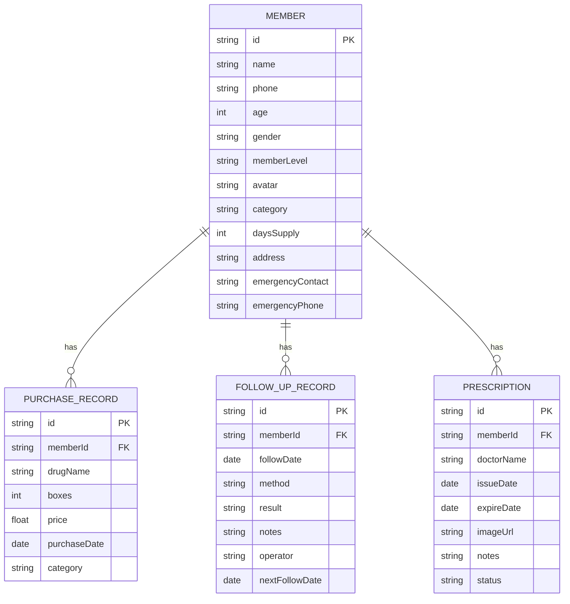

## 1. 架构设计



## 2. 技术描述

- **前端框架**：React@18 + TypeScript + Vite
- **样式方案**：Tailwind CSS@3
- **状态管理**：Zustand
- **路由管理**：React Router DOM@6
- **图标库**：lucide-react
- **数据方案**：Mock 数据 + localStorage 持久化（前端纯演示）
- **初始化工具**：vite-init

## 3. 路由定义

| 路由路径 | 页面名称 | 说明 |
|----------|----------|------|
| / | 今日待提醒 | 默认首页，展示待提醒会员列表 |
| /member/:id | 会员详情 | 展示会员详细信息和跟进操作 |
| /statistics | 店长统计 | 展示跟进完成率和统计数据 |

## 4. 数据模型

### 4.1 数据模型 ER 图



### 4.2 核心类型定义

```typescript
// 会员类型
interface Member {
  id: string;
  name: string;
  phone: string;
  age: number;
  gender: 'male' | 'female';
  memberLevel: 'normal' | 'silver' | 'gold';
  avatar: string;
  category: 'hypertension' | 'diabetes' | 'lipid' | 'other';
  lastPurchaseDate: string;
  lastBoxes: number;
  daysSupply: number;
  remainingDays: number;
  prescriptionStatus: 'valid' | 'expiring' | 'expired';
  lastFollowResult: string;
  lastFollowDate: string;
  nextFollowDate: string;
  address: string;
  emergencyContact: string;
  emergencyPhone: string;
}

// 购药记录
interface PurchaseRecord {
  id: string;
  memberId: string;
  drugName: string;
  boxes: number;
  price: number;
  purchaseDate: string;
  category: string;
}

// 处方
interface Prescription {
  id: string;
  memberId: string;
  doctorName: string;
  issueDate: string;
  expireDate: string;
  imageUrl: string;
  notes: string;
  status: 'valid' | 'expiring' | 'expired';
}

// 跟进记录
interface FollowUpRecord {
  id: string;
  memberId: string;
  followDate: string;
  method: 'phone' | 'sms' | 'visit';
  result: 'connected' | 'no_answer' | 'not_needed' | 'purchased';
  notes: string;
  operator: string;
  nextFollowDate: string;
}

// 话术模板
interface ScriptTemplate {
  type: 'phone' | 'sms' | 'visit';
  category: string;
  title: string;
  content: string;
}

// 统计数据
interface Statistics {
  todayTotal: number;
  todayCompleted: number;
  todayRate: number;
  weekTotal: number;
  weekCompleted: number;
  weekRate: number;
  categoryStats: { name: string; count: number; completed: number; rate: number }[];
  staffRanking: { name: string; count: number; completed: number; rate: number }[];
}
```

## 5. 项目目录结构

```
src/
├── components/          # 通用组件
│   ├── MemberCard.tsx       # 会员卡片
│   ├── StatusBadge.tsx      # 状态标签
│   ├── StatCard.tsx         # 统计卡片
│   ├── CategoryTabs.tsx     # 分类标签
│   ├── FollowUpModal.tsx    # 跟进弹窗
│   └── ScriptPanel.tsx      # 话术面板
├── pages/               # 页面组件
│   ├── ReminderList.tsx    # 今日待提醒
│   ├── MemberDetail.tsx    # 会员详情
│   └── Statistics.tsx      # 店长统计
├── store/               # 状态管理
│   └── useMemberStore.ts   # 会员数据 store
├── data/                # Mock 数据
│   ├── members.ts          # 会员数据
│   ├── purchaseRecords.ts  # 购药记录
│   ├── prescriptions.ts    # 处方数据
│   ├── followUps.ts        # 跟进记录
│   └── scripts.ts          # 话术模板
├── utils/               # 工具函数
│   ├── dateUtils.ts        # 日期计算
│   ├── memberUtils.ts      # 会员相关计算
│   └── constants.ts        # 常量定义
├── types/               # 类型定义
│   └── index.ts
├── App.tsx
├── main.tsx
└── index.css
```

## 6. 核心业务规则

1. **剩余天数计算**：上次购药日期 + (购买盒数 × 每盒服用天数) - 当前日期
2. **下次跟进日期**：
   - 已接通：下次用药到期前 7 天
   - 未接通：次日继续跟进（最多 3 次后改为一周后）
   - 暂不需要：两周后再跟进
   - 已到店购买：按新的用药周期重新计算
3. **处方状态**：
   - 有效期 > 30 天：有效（绿色）
   - 有效期 ≤ 30 天：即将到期（橙色）
   - 已过期：失效（红色）
4. **提醒优先级**：剩余天数越少越靠前，相同天数按会员等级排序
